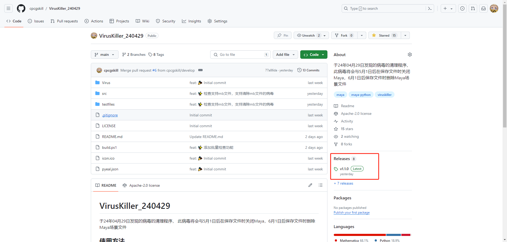
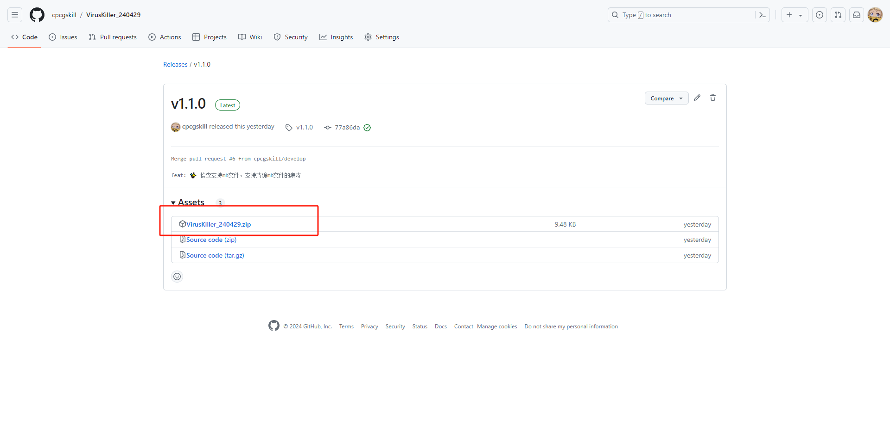

# VirusKiller_240429

A cleaner for the virus discovered on April 29, 2024. This virus will close Maya when saving files after May 1 and delete Maya scene files when saving after June 1.

## Usage Instructions

#### Download the latest zip package from the release section

#### Extract to any directory

#### Drag and drop `install.mel` into the Maya window to run

#### Execute the corresponding function as needed
1. `Clear the main virus`
2. `Clear HIK virus separately`
3. `Restore UAC settings`
4. `Clear virus script nodes`
5. `Batch clean Maya files (.ma)`
6. `Batch clean Maya files (.mb)`
7. `Batch check`

## Project Structure

- `icon.ico` - Program icon
- `pyeal.json` - Packaging configuration
- `src` - Source code
- `Virus` - Main virus body, virus parsing data (Note: For learning and communication purposes only, do not distribute or run this part of the code)
- `images` - Images

## FAQ

#### There is no install.mel file in the latest compressed package I downloaded

Check if you downloaded the source code instead. `Source code (zip)` and `Source code (tar.gz)` are both source code files.

#### How to use the batch cleaning function

1. Back up the files that need to be cleaned
2. Click the button to start the plugin
3. Select all the files that need to be cleaned
4. Click `Done | OK`

#### How to use the batch check function

1. Click the button to start the plugin
2. Select the root directory to be checked
3. Click `Done | OK`