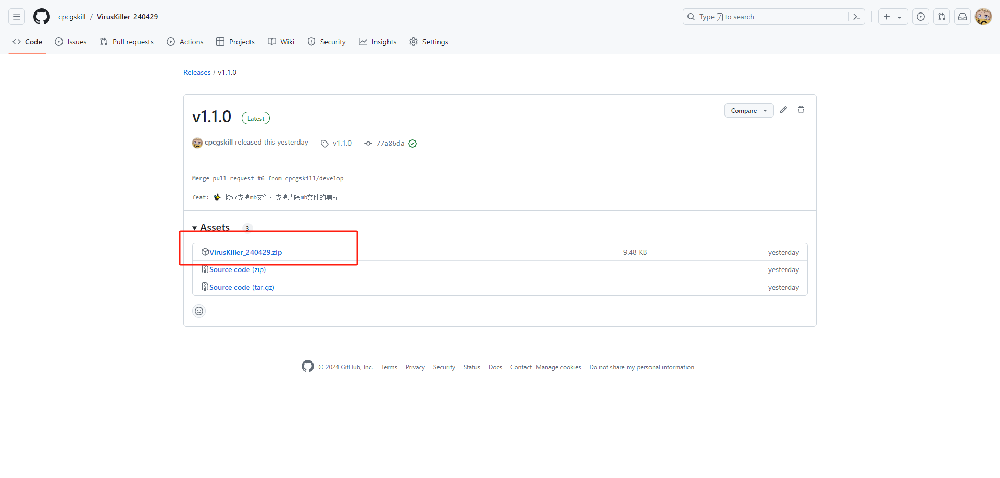
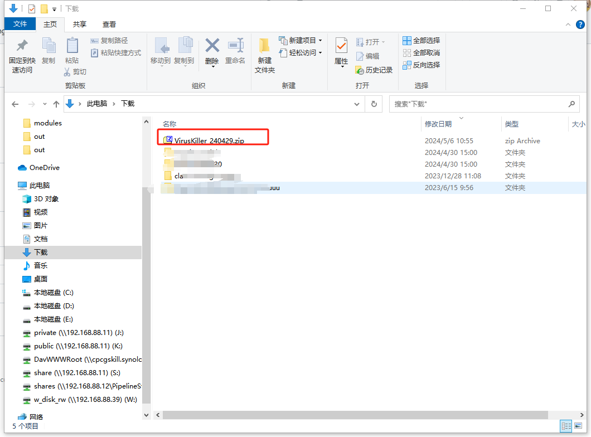
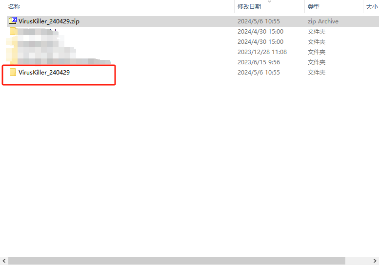
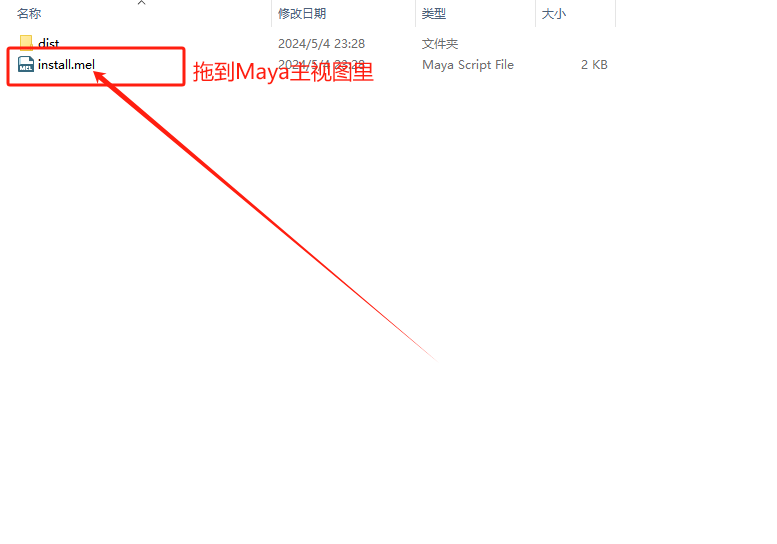

# VirusKiller_240429

24年4月29日に発見されたウイルスのクリーニングプログラムです。
このウイルスは、5月1日以降にファイルを保存する際にMayaを終了させ、6月1日以降にファイルを保存する際にMayaシーンファイルを削除します。

## 使用方法

#### リリースから最新のzipインストーラーをダウンロード

#### 任意のディレクトリに解凍

#### install.melをMayaウィンドウにドラッグして実行

#### 必要に応じて以下の機能を実行
1. `ウイルス本体を除去`
2. `HIKウイルスのみを除去`
3. `UAC設定を復元`
4. `ウイルススクリプトノードを除去`
5. `Mayaファイル(.ma)を一括クリーニング`
6. `Mayaファイル(.mb)を一括クリーニング`
7. `一括チェック`

## プロジェクト構造

- `icon.ico` - プログラムアイコン
- `pyeal.json` - パッケージ設定
- `src` - ソースコード
- `Virus` - ウイルス本体、ウイルス解析データ ps: 学習および交流のためのみ使用し、拡散や実行はしないでください
- `images` - 画像

## FAQ

#### ダウンロードした最新の圧縮ファイルにinstall.melファイルがありません

ソースコードをダウンロードしたかどうかを確認してください。 `Source code (zip)` または `Source code (tar.gz)` はソースコードファイルです。

#### 一括クリーニング機能の使用方法

1. クリーニングするファイルをバックアップ
2. ボタンをクリックしてプラグインを起動
3. クリーニングするすべてのファイルを選択
4. `完了|OK`をクリック

#### 一括チェック機能の使用方法

1. ボタンをクリックしてプラグインを起動
2. チェックするルートディレクトリを選択
3. `完了|OK`をクリック