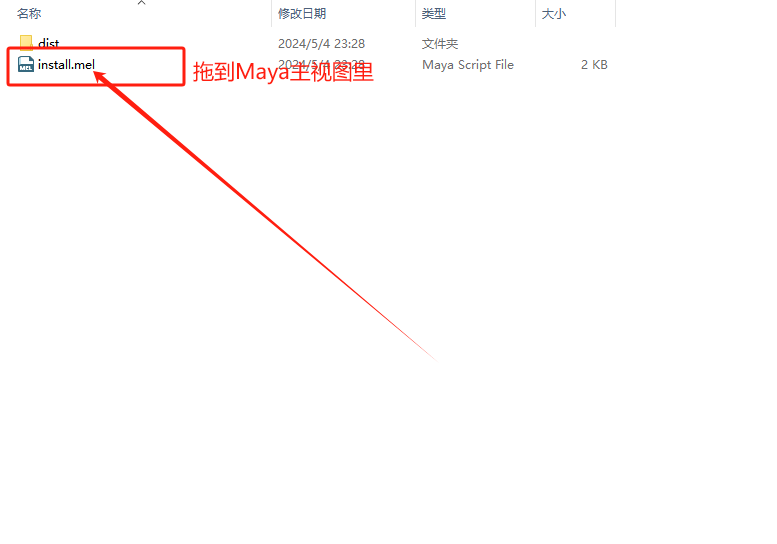

# VirusKiller_240429

于24年04月29日发现的病毒的清理程序，
此病毒将会与5月1日后在保存文件时关闭Maya，6月1日后保存文件时删除Maya场景文件

- 2024/10/11 此病毒出现变种，将会在6月1日之后仍然生效，请注意！PS： 目前杀毒程序仍然兼容，暂时无需更新

- [English](./README.en-US.md)
- [日本語](./README.ja-JP.md)

## 使用方法

#### 下载release中最新的zip安装包

#### 解压到任意目录

#### 将install.mel拖动到Maya窗口中运行

#### 根据需要执行对应功能
1. `清除病毒本体`
2. `单独清除HIK病毒`
3. `恢复UAC设置`
4. `清除病毒脚本节点`
5. `批量清理Maya文件(.ma)`
6. `批量清理Maya文件(.mb)`
7. `批量检查`

## 项目结构

- `icon.ico` - 程序图标
- `pyeal.json` - 打包配置
- `src` - 源码
- `Virus` - 病毒本体、病毒解析数据 ps: 仅供学习交流使用, 请勿传播与运行这部分代码
- `images` - 图片

## FAQ

#### 我下载的最新压缩包文件里没有install.mel文件

检测是否下载为源代码了， `Source code (zip)` `Source code (tar.gz)` 都是源代码文件。

#### 如何使用批量清理功能

1. 备份需要清理的文件
2. 点击按钮启动插件
3. 选择所有需要清理的文件
4. 点击 `完成|OK`

#### 如何使用批量检查功能

1. 点击按钮启动插件
2. 选择需要检查根目录
3. 点击 `完成|OK`
